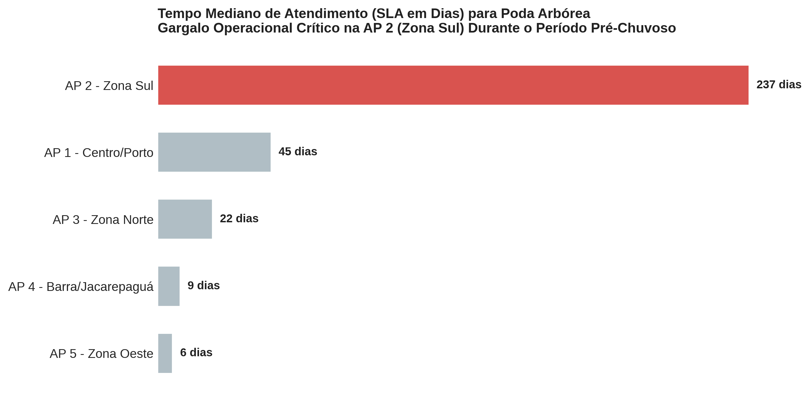
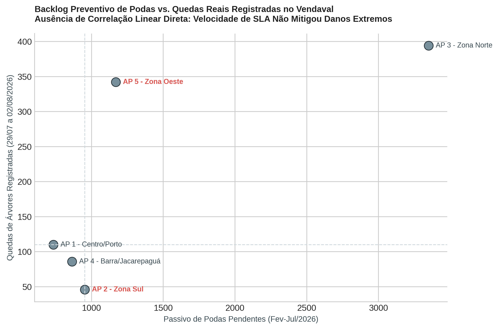

# Resiliência Urbana e Manejo Arbóreo no Rio de Janeiro
### Análise Empírica via 1746: Por Que Velocidade Operacional (SLA) Não Mitiga Riscos Climáticos Extremos

---

## 1. Contexto e Problema de Negócio (O Marco Zero)
A intensificação de tempestades severas e frentes frias no Rio de Janeiro impõe desafios severos à zeladoria urbana. A queda recorrente de árvores em dias de chuva e ventania não causa apenas congestionamentos históricos; destrói a rede elétrica, paralisa corredores de transporte e coloca vidas humanas em risco iminente.

Historicamente, a gestão pública avalia a eficiência de suas secretarias por meio de métricas de esforço: o tempo de atendimento (**SLA - Service Level Agreement**) dos chamados do canal 1746. No entanto, focar unicamente na velocidade de fechamento de chamados cria um falso indicador de eficiência (métrica de vaidade): **atender chamados rapidamente não significa mitigar o dano estrutural da cidade**.

* **Objetivo de Negócio:** Investigar os chamados de manejo arbóreo (poda e conservação) para entender as disparidades regionais de atendimento no período pré-chuvas e testar se um menor SLA operacional foi capaz de blindar os bairros contra o vendaval histórico de 29 de julho de 2026.
* **Impacto Esperado:** Fornecer à Secretaria de Conservação e à Comlurb uma diretriz prescritiva para transitar de uma operação puramente reativa para um modelo de manutenção preventiva baseado em risco geográfico.

---

## 2. Governança e Linhagem dos Dados (GIGO)
Para assegurar integridade, auditoria e conformidade com as dimensões de qualidade (Validade, Consistência, Completude e Atualização), os dados foram extraídos e tratados a partir dos repositórios oficiais da Prefeitura do Rio.

* **Armazenamento e Extração:** Google Cloud Platform (BigQuery), consultando o dataset `datario.adm_central_atendimento_1746.chamado` integrado à tabela dimensional `datario.dados_mestres.bairro`.
* **Tratamento e Engenharia (Framework Fix, Drop, Impute, Flag):**
  * **Drop:** Descarte de registros sem ancoragem territorial (31 linhas com bairro/subprefeitura nulos, representando < 0,8% da base).
  * **Flag:** Criação do indicador booleano `resolvido` (`data_fim.notnull()`) para tratar separadamente o passivo pendente e evitar o viés de sobrevivência.
  * **Fix (Consistência Territorial):** Correção da classificação das subprefeituras da **Grande Tijuca** e dos **Grandes Complexos**, incorporando 377 chamados à **AP 3 (Zona Norte)** que haviam sido omitidos pela rotina de texto simples.

### Data Tracking Sheet do Projeto

| Pergunta de Negócio (Business Question) | Dado / Atributo | Base ou Calculada? | Cálculo / Regra de Negócio | Fonte de Dados |
| :--- | :--- | :--- | :--- | :--- |
| Qual chamado foi aberto e qual o serviço? | `id_chamado`, `subtipo` | Base | Filtro: "Poda de árvore em logradouro" | Data.Rio (`chamado`) |
| Em qual macrozona ocorreu a demanda? | `ap_regiao`, `subprefeitura` | Calculada | Mapeamento por correspondência textual das subprefeituras oficiais | Data.Rio (`bairro`) |
| Quando foi solicitado e quando foi encerrado? | `data_inicio`, `data_fim` | Base | Parsing temporal em formato `datetime64[ns]` | Data.Rio (`chamado`) |
| Quanto tempo a Prefeitura levou para atender? | `sla_dias` | Calculada | `DATE_DIFF(DATE(data_fim), DATE(data_inicio), DAY)` | Calculada via DQL/Pandas |
| O serviço foi efetivamente executado? | `resolvido` | Calculada | Booleano: `True` se `data_fim` preenchida, senão `False` | Calculada |
| Qual o backlog pré-evento climático? | `podas_pendentes` | Calculada | Volume sem conclusão aberto entre Fev/2026 e 28/07/2026 | BigQuery / 1746 |
| Qual o dano real sofrido no vendaval? | `quedas_registradas` | Calculada | Chamados de emergência de queda (29/07 a 02/08/2026) | BigQuery / 1746 |

---

## 3. Metodologia Científica e Formulação de Hipóteses
A análise foi conduzida sob o método de decomposição e pensamento analítico:

* **Métrica Central Robusta:** Substituição obrigatória da média aritmética pela **Mediana**. A presença de outliers extremos (chamados que levaram até 743 dias para serem fechados) inflava a média municipal para 101 dias, mascarando que 50% dos chamados da cidade são atendidos em até 21 dias.
* **Hipótese de Trabalho Testada:**
  > *A ocorrência de um menor passivo de podas pendentes nos 6 meses anteriores ao evento está associada a uma diminuição superior a 40% no volume de chamados de queda de árvore durante a semana do vendaval de 29/07/2026.*

---

## 4. Resultados e Storytelling Explanatório

### Visualização 1: O Paradoxo da Zona Sul (Rotina Pré-Verão)
A avaliação da eficiência de atendimento revelou um abismo operacional entre as regiões administrativas:



* **Diagnóstico dos Dados:** A **AP 2 (Zona Sul)** apresentou o pior SLA mediano da cidade: **237 dias** (quase 8 meses) para atender a uma solicitação de poda preventiva. Em contraste, a **AP 5 (Zona Oeste)** atingiu a marca de **6 dias**, e a **AP 3 (Zona Norte)** registrou **22 dias**, absorvendo o maior volume absoluto (1.918 chamados).
* **Causa Raiz Operacional (Diagrama de Ishikawa em Serviços):** A morosidade na Zona Sul não decorre de desídia das equipes, mas de restrições de processo: exigência de laudos prévios para árvores centenárias tombadas (Fundação Parques e Jardins), necessidade de desligamento programado da rede aérea de alta tensão (Light) e restrições severas de interdição de tráfego pela CET-Rio em vias adensadas.

---

### Visualização 2: O Teste de Estresse Climático (Vendaval de Julho/2026)
O cruzamento entre o passivo de podas não atendidas nos 6 meses anteriores ao evento e o volume de quedas reais registradas no vendaval desmontou a tese de causalidade direta:



* **A Quebra da Hipótese:** A **AP 5 (Zona Oeste)** — região de resposta mais rápida no dia a dia (SLA de 6 dias) — posicionou-se no **Quadrante Superior Direito**, acumulando mais de **340 árvores tombadas**. 
* **O Insight Estratégico:** A velocidade no fechamento de chamados pontuais funcionou como uma métrica de vaidade. A Zona Oeste sofreu destruição em massa devido a fatores exógenos: rajadas de vento canalizadas em áreas descampadas, topografia desprotegida e espécies arbóreas mais vulneráveis ao cisalhamento. A resposta rápida da rotina não se traduziu em resiliência climática.

---

## 5. Recomendações Prescritivas (Framework CAMS)

A gestão municipal deve superar o modelo de atendimento reativo baseado em tickets do 1746 e estruturar uma operação preventiva:

* **Cultura:** Alterar a remuneração e metas dos distritos operacionais da Comlurb. O foco deve deixar de ser o menor SLA em dias (que incentiva o fechamento de podas fáceis) e passar a ser o **Índice de Cobertura Arbórea Crítica**.
* **Automação:** Implementar rotinas em nuvem (BigQuery + APIs meteorológicas) para alertar automaticamente as subprefeituras sobre corredores de ventania iminente, despachando caminhões com antecedência para as vias arteriais de maior risco.
* **Métricas:** Instituir uma meta mandatória de redução do passivo: garantir que nenhuma árvore em corredores estruturais permaneça mais de 30 dias em backlog durante os meses de outono e inverno.
* **Compartilhamento:** Criar um comitê integrado de despacho (Comlurb, Defesa Civil, CET-Rio e Light) para destravar autorizações e desligamentos conjuntos na Zona Sul, reduzindo o tempo de atendimento de 237 para menos de 60 dias.

---

## 6. Estrutura do Repositório
```text
├── README.md                           # Storytelling executivo e documentação
├── requirements.txt                    # Dependências do projeto
├── sql/
│   ├── 01_extracao_preventiva_2023.sql # DQL no BigQuery (recorte de rotina)
│   └── 02_extracao_estresse_2026.sql   # DQL no BigQuery (confronto vendaval)
├── notebooks/
│   └── analise_exploratoria_1746.ipynb # Profiling, limpeza e exploração
├── scripts/
│   └── pipeline_resiliencia_urbana.py  # Pipeline ponta a ponta em Python
└── outputs/
    ├── fig1_gargalo_sla_zona_sul.png   # Visualização explanatória 1
    ├── fig2_dispersao_passivo_vs_quedas.png # Visualização explanatória 2
    └── tabela_executiva_ap.csv         # Tabela tratada consolidada
